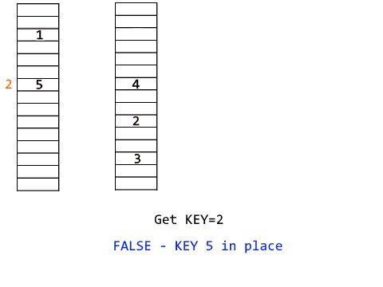
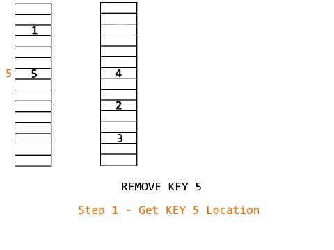

## Chinese Remainder Theorem based HashMap (Layered Hash Table)
A C++11 header for HashMap structure

### Info
A project of mine made some time ago. While tinkering about HashMaps I realized I could do a really simple auto-dynamically-allocating one.

By using the properties of Chinese Remainder Theorem we can achieve extremely quick read and writes, as well as keeping the memory allocation low as it can be.

Tested on a ridiculously big number of objects. Could be used to find 1 in 10^9 (1000000000) objects by using only 16GB of space - average search depth is 2.26 reads, maximum search depth is 7 reads - so yeah, really really fast.
It can be set to go even faster (avg 1.4 max 5) but requires twice the memory usage.

For those that are interested you can read more in the included [PDF file](ShortExplanation.pdf).

### Install
Clone the repo and just `make` . The repo supports MinGW and Linux.
This will only compile the example, but what more do you need.

## Benchmark
Check the makefile. You can either compile my version of the HashMap or the stdlib `std::unordered_map<>` .
The Sources are _wrapped_.

By uncommenting-commenting just two lines in the makefile _(yes, it's commented where to do it)_ you can check the code against the stdlib implementation.

Currently, I see this as an absolute win. However, please try using this on different datasets.


### Usage
The namespace used is CRT (as in Chinese Remainder Theorem). You can check sample usage in example.cpp file.
To create an empty HashMap use
```C++
 CRT::HashMap<string, int> hash;   //! string to int mapping
```
This creates an empty HashMap of size 10000 elements, that uses ascending memory allocation.
Should you want to create a bigger default HashMap or set the memory allocation as descending you can use the constructor. I would recommend setting the default HashMap to 0.7*Probable_number_of_your_objects
```C++
 CRT::HashMap<string, float> hash(10000000, true); 
 // Reserves 10 000 000 objects in the memory and sets the dynamic memory allocation to true
 // Key=string , Value=float
```

If you would like to compile with some other template pair include it in the .cpp files for now.

### Future

I've got some changes I need to do. _(further optimize speed, simplify usage, improve debug and logging)_

### Example
To compile the included example
```console
 make
```

### Methods

#### void put(Key, Value)


```C++
 hashmap.put("requested key", Value);
 // maps Value to "requested key", if it fails to do so in this block, it allocates new block of memory for the next block
 // Overwrites the old value if found
```
The method also automatically optimizes the hashmap

#### bool get(key, value)



```C++
 if( hashmap.get("requested key", value) )
 {
	result=value;
	//If this is true then the Value is stored in value (nonreferenced). //Copy constructor on value needed
 }
 else
 {
	//no "requested key" found
 }
```
The method automatically optimizes the hashmap where it can

#### void remove(key)



```C++
 hashmap.remove( "requested key") )
 // removes the "requested key" mapping from memory
```
#### void clear()
```C++
 hashmap.clear()
 //deallocates all blocks and allocates one block of the same size as it started with
```

### Other
Should you use your custom object as value don't forget to assign the correct copy constructor for it.

~~I've commented a few methods I didn't use but you could find useful. HashMap::print_all() prints all elements of the table and the flags on positions. Feel free to uncomment it in 'Block.h' 'and HashMap.h' and use.~~
You can now use the VERBOSE_DEBUG define flag while compiling.

The structure could be easily repurposed to read from HardDrive instead of RAM should you have even more elements, or even made with multithread support to get the best out of the speed and memory allocation.

Or both.